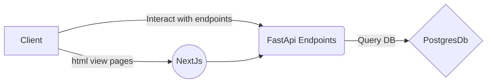

# NEURALSIGHT PROJECT DOCUMENTATION.

## Introduction.
NEURALSIGHT system is a combination of YOLOv5 trained model and a set of endpoints that allows users to detect 14 Chest X-ray pathologies. The model is trained using a VinBig dataset of X-ray images and annotations of the 14 pathologies of interest. The model is able to predict bounding boxes and class probabilities for each object (pathology) in an image. The endpoints allow users to perform tasks such as logging in and uploading images for prediction, as well as viewing and downloading the prediction results and reports. The model is already trained hence the users only require to upload their XRAY images and be able to get response as the prediction and reports. The model has been evaluated on a test dataset and has shown to have good performance in terms of metrics such as average precision and mean average precision. The model is deployed using FastAPI, which is a lightweight web framework for building web applications and APIs, and is easily integrated with other technologies.


### Project Data Acquring.

#### Dataset Description
For this dataset, the main aim was to come up with an object classifying system for common thoracic lung diseases and localizing critical findings. This is an object detection and classification problem. The images are in png file with difference dimensions i.e 1024, 216 and 512. In this project, Images that were used were the one with 512 dimensions.

Dataset information
The dataset comprises 67914 annotated and those not annotated images where there was only 4394 unique patients images that were annoted  for postero-anterior (PA) Xrays scans in PNG format. All images were labeled by a panel of experienced radiologists for the presence of 14 critical radiographic findings as listed below:
```
    0 - Aortic enlargement
    1 - Atelectasis
    2 - Calcification
    3 - Cardiomegaly
    4 - Consolidation
    5 - ILD
    6 - Infiltration
    7 - Lung Opacity
    8 - Nodule/Mass
    9 - Other lesion
    10 - Pleural effusion
    11 - Pleural thickening
    12 - Pneumothorax
    13 - Pulmonary fibrosis
    The "No finding" observation (14) was intended to capture the absence of all findings above but in this case it was ignored.
```


### Data preprocessing.

The Model (YOLOv5) requires specific data preprocessing steps in order to work effectively. In this case, we were to process our information to meets this starndard. The following is a detailed workflow documentation of the data preprocessing steps that were taken in this particular case:

- Dropping images with `No findings` label: The first step in preprocessing the data was to drop all images with their label infroamtion that had a label called "No findings" because the label had no any bounfing box information which were needed for model training. This was done to ensure that the model only focuses on images that contain the other 13 Chest X-ray pathologies of interest.

- Removing overlapping bounding boxes which occurs in the same class using Non-maximum suppression methos: In order to improve the performance of the model, non-maximum suppression was used to remove overlapping bounding boxes which occurs in the same class label. This technique helps to reduce the number of false positives by removing bounding boxes that have a high overlap with other boxes of the same class. The method worked as follows.
    - Non-maximum suppression(NMS) function is  used for removing overlapping bounding boxes. The function takes in two inputs: "boxes" and "overlapThresh". The "boxes" is a list of bounding boxes in the format of (x1, y1, x2, y2) where (x1, y1) is the top-left corner and (x2, y2) is the bottom-right corner. "overlapThresh" is a threshold value for the overlap ratio of bounding boxes.

    - The function first checks if the input "boxes" is an empty list. If it is, it returns an empty list. If there are boxes, the function extracts the x and y coordinates of the top-left corner and bottom-right corner of each box. It then computes the area of each bounding box and sorts the boxes based on the bottom-right y-coordinate. Next, the function iterates through each box and compares it with the other boxes to calculate the ratio of overlap. If the overlap ratio is greater than the threshold, the function removes that box from the list of boxes to be returned. Finally, the function returns the remaining boxes as integers.

- Bounding Box information Normalization: The bounding box information were normalized to standard values between 0 and 1 against the width and height of the image. This ensures that the bounding box coordinates are consistent regardless of the size of the input image that a user will feed to the model. It allows us to work on any image size available.
- Calculating the height and width of the bounding box since it they are one of the crucial features that must be fed to the model during traing and they are used to identify where what is the size of the box.

- Training and Validation.
Before Trainign, We splittted the data inot two in order to validate the model after training. We used `GroupKFold method to split`. This method is a variation of the KFold method for cross-validation. It is used to split the data into `k` number of folds, where `k` in this case, we used k= 5 which means the data will be split into 5 folds.
The main difference between GroupKFold and other cross-validation techniques like train_test_split is that it helped takes into account pathologies or labels for each class in the sample split equally. i.e, Since some pathologies had more class Distribution than others, It helped us ensure that the samples from one class label of pahtology do not end up in the same group and are equally Distributed in both groups. For this project, since the data is split into 5 folds, 1/5 (or 20%) of the data will be used as the test set, while 4/5 (or 80%) will be used as the training set.


#### Preparation of dataset Structure for modeelling.
To structure the images and labels for YOLOv5 training, We created the following 4 directories where the training and validation information was to reside.
    1. `/WORKING_DIR/PROJECT_DIR/labels/train` - This directory will store the labels (annotations) for the training images.
    2. `/WORKING_DIR/PROJECT_DIR/labels/val` - This directory will store the labels (annotations) for the validation images.
    3. `/WORKING_DIR/PROJECT_DIR/images/train` - This directory will store the training images.
    4. `/WORKING_DIR/PROJECT_DIR/images/val` - This directory will store the validation images.


Once the directories were created, We then moved or copy the images and their corresponding labels to the appropriate directories. The labels for each image should have the same file name as the image, and should be placed in the appropriate labels directory (either `/WORKING_DIR/PROJECT_DIR/labels/train` or `/WORKING_DIR/PROJECT_DIR/labels/val`).
The labels were also in their own format. Each image had a single text file as labels. The format of labels for YOLOv5 model used was a plain text file with the same name as the corresponding image file, and with a `.txt` extension. The file should contain one line for each object in the image, with the following format:
  ````
  class_id x_center y_center width height
  ````
where
  - class_id: An integer representing the class of the object. This should correspond to the class labels in your dataset.
  - x_center: The x-coordinate of the center of the bounding box, as a fraction of the image width.
  - y_center: The y-coordinate of the center of the bounding box, as a fraction of the image height.
  - width: The width of the bounding box, as a fraction of the image width.
  - height: The height of the bounding box, as a fraction of the image height.

Each object should be split in a new line. Here's an example of a label file for an image with two objects, a Pneumothorax and a Cardiomegaly:
  ````
  12 0.5 0.5 0.2 0.2
  3 0.7 0.7 0.1 0.1
  ````

This means that there is one Pneumothorax object with class label 12, center coordinates (0.5,0.5), width and height as 0.2 and one Cardiomegaly object with class label 3, center coordinates (0.7,0.7), width and height as 0.1

### Data Information Pointer.
A YAML file was created which contained all information about the training and valtion dataset. The file had the following information.
````yaml
  names:
  - Cardiomegaly
  - Pleural effusion
  - Pleural thickening
  - Aortic enlargement
  - Pulmonary fibrosis
  - ILD
  - Nodule/Mass
  - Other lesion
  - Lung Opacity
  - Infiltration
  - Consolidation
  - Calcification
  - Atelectasis
  - Pneumothorax
  nc: 14
  train: /kaggle/working/train.txt
  val: /kaggle/working/val.txt

````
where:
  - train and val is a text file with all directories for images used for training and validation respectively
  - nc is the number of classes
  - names contains all class namees


## Data Modelling.
In this project, we used two popular object detection models, Detectron and YOLO, for the detection of 14 different pathologies in Xray medical images. The goal of the project was to determine which model performed better in detecting these 14 pathologies objects.
Detectron is an object detection framework developed by Facebook AI Research. It is built on the popular Caffe2 deep learning framework and is designed to be easy to use and highly customizable. Detectron is particularly well-suited for object detection tasks that require fine-grained control over the model architecture and training process.
YOLO (You Only Look Once) is a real-time object detection model that is known for its speed and accuracy. It is a single convolutional neural network that can detect multiple objects in a single image. YOLO is designed to be fast and efficient, making it a popular choice for real-time object detection tasks. Yolo is designed in multiple format and for this project we used ultralylic method.

In our evaluation of these two models, we found that YOLO performed better in detecting the 14 pathologies we were interested in. Specifically, YOLO achieved a higher mean average precision (MAP) and a lower mean average false positive rate (MAFPR) compared to Detectron. These results suggest that YOLO is more suitable for this type of medical image detection task.

However, it's important to note that the performance of the models will depend on the specific use case, the dataset and the model's hyperparameter tuning. Furthermore, it's always good to evaluate and compare different models before making a decision.


## Data Validation
After training, the model needs to be evaluated on the test dataset to measure its performance. This includes metrics such as:

  - Accuracy: The proportion of correctly classified instances (True Positive + True Negative) / Total.
  - Loss: The difference between the predicted and true values.
  - Precision: The proportion of true positive predictions among all positive predictions.
  - Recall: The proportion of true positive predictions among all actual positive instances.
  - mAP50:.......

After training, the following information are perfomanmce for the model.
````
Class     Images  Instances     P          R          mAP50   
all        878       3941      0.432      0.424       0.37      0.162
````

Here is a model summary on all classes after training.
````
Model summary: 322 layers, 86260891 parameters, 0 gradients, 204.0 GFLOPs
                 Class     Images  Instances          P          R      mAP50   
                   all        878       3941      0.432      0.423       0.37      0.162
          Cardiomegaly        878        490      0.847      0.886       0.93      0.536
      Pleural effusion        878        251      0.462       0.51      0.429      0.133
    Pleural thickening        878        631      0.297      0.349      0.233     0.0627
    Aortic enlargement        878        612      0.797      0.895      0.894       0.45
    Pulmonary fibrosis        878        492      0.314      0.376      0.258     0.0838
                   ILD        878        107      0.293      0.364      0.242      0.096
           Nodule/Mass        878        281      0.398      0.448      0.334      0.139
          Other lesion        878        316      0.244      0.215      0.139     0.0429
          Lung Opacity        878        330      0.332      0.306      0.218      0.079
          Infiltration        878        171      0.492      0.345      0.368      0.148
         Consolidation        878         93      0.459      0.226      0.338      0.142
         Calcification        878        117      0.231      0.376      0.203     0.0885
           Atelectasis        878         32      0.598      0.186      0.252     0.0789
          Pneumothorax        878         18      0.287      0.444       0.35      0.187
````

Here is an Image Example for Confusion Matrix  and F1 curve for Trainign.


For Testing with an IOU of 0.6, The following is the result summary

````markdown
Model summary: 322 layers, 86220517 parameters, 0 gradients, 203.9 GFLOPs
val: Scanning '/kaggle/working/val.cache' images and labels... 876 found, 0 miss
                 Class     Images  Instances          P          R      mAP50   
                   all        876       6181      0.493      0.322       0.33      0.154
          Cardiomegaly        876       1120      0.783      0.408      0.479      0.309
    Aortic enlargement        876       1476      0.765      0.415      0.569      0.319
    Pleural thickening        876        902      0.384      0.253      0.219     0.0659
           Nodule/Mass        876        423      0.343      0.369       0.29      0.148
    Pulmonary fibrosis        876        797      0.353      0.325      0.283     0.0998
          Lung Opacity        876        499      0.342      0.291      0.242     0.0864
          Other lesion        876        490      0.368      0.155      0.141     0.0512
      Pleural effusion        876        474      0.607      0.359      0.419      0.153
Speed: 0.2ms pre-process, 64.9ms inference, 2.0ms NMS per image at shape (32, 3, 640, 640)
Results saved to runs/val/exp
````
Below are Confusion Matrix And F1 Curve showing perfomances for each Pathologies Label.


## Model Deployment.
Model deplotment was done by create endpoints using FastAPI  which allows user to interact with the model and involves creating endpoints for various actions related to the model.

For the fastApi, In order to validate user's input, We used pydantic for the validation. Pydantic is a library for data validation and settings management using Python type hints. It is often used in conjunction with the FastAPI web framework to provide input validation for user-submitted data. To user it, We created a Pydantic models to define the structure and validation rules for the user's input data that we needed. For example, a model for a user registration form might look like this:

````python
from pydantic import BaseModel, validators

class UserModel(BaseModel):
    username: str
    password: str
    email: str = None
    age: int

    @validators.email(allow_none=True)
    def email_is_valid(cls, value):
        return value


````
It helped us in knowing what input will be received and the output as the response. If input were wrong, a response for wrong input would be raised to the user. Figure below shows the workflow of creating the models and routes using fastApi.


Figure below shows an Overview Diagram of the whole Deployment of NEURALSIGHT system On without using any service.


Figure below shows an Overview Diagram of the whole Deployment of NEURALSIGHT system On Docker.


The following is a brief documentation on the endpoints that you have created for your deployment:

The Trained YOLOv5 model was integrated with the endpoints to perform the object detection on the uploaded X-ray images, and the results stored in the database and which allows it to be retrieved by the doctor later on. The API is built using FastAPI which allows to handle the HTTP requests and responses in a very fast and efficient way.

Some of the endpoints created include the following:
- /register - This endpoint allows a super ADMIN to register a doctor with the system by providing their email, password, location, and hospital information. This information is stored in a PostgreSQL database.
- /login - This endpoint allows a doctor to login to the system by providing their email and password.
- /patient - This endpoint allows a doctor to create a new patient by providing a unique ID. The patient's information is stored in the database.
- /upload - This endpoint allows a doctor to upload an X-ray image for scanning for a specific patient using the patient's ID.
- /update_report - This endpoint allows a doctor to update the report concerning the X-ray scan response from the image which was scanned.
- /patients - This endpoint allows a doctor to query all patients they have registered in the system.
- /delete - This endpoint allows a doctor to delete a patient from the system.


>>>>MORE TO BE ADDED


## Using The model's Endpoints.
#### 2. Training Configuration
```
    Before starting training the script, an environment file (.env) will need to be created with the following parameters.

    DATA_DIRECTORY=<path to root folder of the data>
    TRAIN_DIR=<path to a directory where the training data and information will be placed>
    WANDB_API_KEY=<wandb secret key>
    CURR_DIR=<path to current working directory>
```
```
  step1:
    pip install -r requirements.txt
  step2:
    python  cleaning.py
  step3:
    python process.py
  step4:
    python  extract.py
  step5:
    python -m training.py

```

#### 2. Running Inferences Endpoints.
```
  cd NeuralSight_AI

- `sudo docker build -t <image name> .`
- `docker run -d -p 80:80 <image name>`


OR

  sudo docker-compose build
  sudo docker-compose up
```
- After runiing the above, navigate to use browser and type domain e.g `127.0.0.0:8000` if you are on your local machine

## Model Monitoring - We are yet to do this.
## Orchestration - We are yet to do this.
